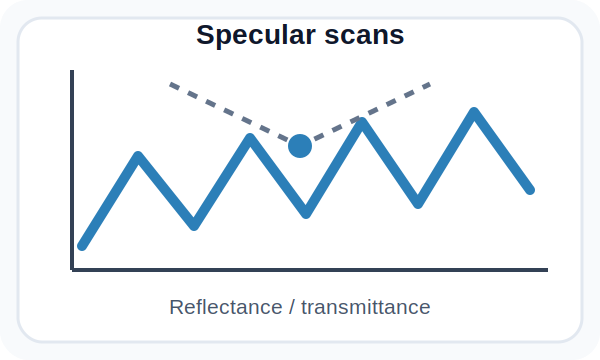
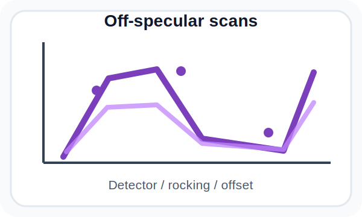
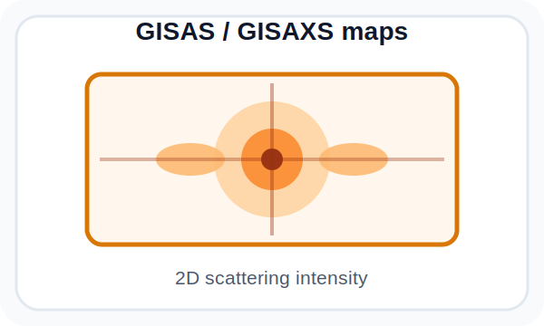
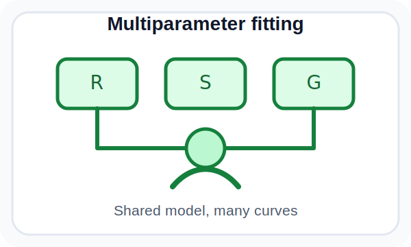

# Multifitting

**Multifitting** is a GUI-based application for modelling multilayer nanofilms and fitting experimental reflectometry, off-specular scattering and grazing-incidence small-angle scattering data. The main workflow happens in the graphical interface: users build a sample structure, load measured curves or maps, enable the required physical models, run calculations or fitting, and inspect the resulting plots.

Multifitting is designed for cases where several measurements have to be interpreted with one shared structural model. Layer thicknesses, densities, roughness, interlayers, particles, thickness/sigma drifts and aperiodic profiles can be simulated and refined together.

## Capabilities

- **GUI-first workflow:** create structures, edit measurements, configure fitting, inspect profiles and compare calculated and experimental data from the graphical interface.
- **Specular optics:** calculate reflectance, transmittance and absorptance for angular and wavelength/energy scans.
- **Off-specular scattering and GISAS/GISAXS:** work with detector scans, rocking scans, offset scans and 2D grazing-incidence scattering maps; include instrumental smoothing and specular-peak treatment when needed.
- **Field and absorption maps:** calculate in-depth field intensity and absorption maps for multilayer stacks.
- **Flexible multilayer models:** build ambient/layer/substrate stacks, periodic multilayers, general aperiodic stacks and regular aperiodic profiles; describe materials by tabulated optical constants or by elemental composition and density.
- **Interface physics:** model interlayers with erf, linear, exponential, tanh, sine and step transition functions; include thickness and roughness drifts through linear, random and sine terms.
- **Roughness and power spectral density:** use perturbation-theory, distorted-wave Born approximation, self-affine and correlated self-affine models; combine analytical roughness spectra, measured 1D/2D power spectral density data, Gaussian roughness peaks and vertical-correlation/inheritance models.
- **Particles:** add spherical, spheroidal or cylindrical inclusions; model disorder or radial-paracrystal interference and square, hexagonal or radial in-plane geometry.
- **Instrument model:** account for spectral and angular beam distributions, beam footprint, sample size/position/curvature, 1D and 2D detector settings, resolution and binning.
- **Multiparameter fitting:** fit several target curves and structures simultaneously with local or global optimization methods; support bounded parameters, linked parameters, custom residual expressions, weights, scale factors and confidence-interval scans.
- **Data handling:** import 1D and 2D experimental data, optionally with error bars; export calculated curves, matrices, roughness spectra and fitting statistics.

<p align="center">
  
  
  
  
</p>

## Typical workflow

1. Start the graphical interface and create a sample structure from layers, periodic multilayers or aperiodic components.
2. Choose material data from the built-in optical-constant and atomic scattering-factor tables, or define materials by elemental composition and density.
3. Load experimental target curves: specular scans, off-specular scans or 2D grazing-incidence scattering maps.
4. Enable the physical effects relevant to the experiment: interlayers, roughness spectra, particle scattering, footprint, beam divergence and detector resolution.
5. Mark parameters as fitable or linked to other parameters, choose an optimization method, then run fitting and confidence-interval analysis.
6. Inspect calculated curves, residuals, depth profiles, roughness plots, particle plots and exported text files.

## Get started

For normal use, download a ready-to-use package from the [latest GitHub release](https://github.com/svech/Multifitting/releases/latest), when available. Release packages are intended to include the application resources needed by the GUI, such as optical data tables, settings, icons, manuals and sample projects.

After launching Multifitting, start with the included manuals and examples to see how structures, target curves, calculations and fitting settings are organized.

## Publications

If Multifitting is useful in your work, please cite the relevant paper:

- M. Svechnikov, **“Multifitting 2: software for reflectometric, off-specular and grazing-incidence small-angle scattering analysis of multilayer nanofilms,”** *Journal of Applied Crystallography* **57**(3), 848–858 (2024). https://doi.org/10.1107/S1600576724002231
- M. Svechnikov, **“Multifitting: software for the reflectometric reconstruction of multilayer nanofilms,”** *Journal of Applied Crystallography* **53**(1), 244–252 (2020). https://doi.org/10.1107/S160057671901584X

## Build from source, optional

Most users should use a release package. Build from source only if you need to compile Multifitting yourself or adapt it to a local environment.

Multifitting is a Qt Widgets/qmake C++17 application. It uses GSL, Boost, RandomOps and SwarmOps, and includes third-party headers such as QCustomPlot and Faddeeva. The current qmake project expects these numerical libraries to be available in the local paths configured in `source/Multifitting.pro`; adjust those paths before building.

```bash
cd source
qmake Multifitting.pro
make
```
