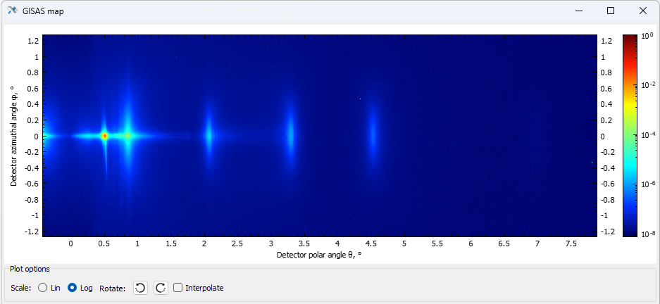

# Multifitting

Multifitting is a Qt/C++ application for simulation and multiparameter fitting of optical, reflectometric and scatterometric data from multilayer nanofilms. It helps reconstruct layer thicknesses, densities, roughness, interlayers, particles and aperiodic profiles from one or many experimental curves.

## Capabilities

- Specular reflectance, transmittance and absorptance in angular and spectral scans.
- Off-specular detector, rocking and offset scans, plus GISAS/GISAXS maps.
- Simultaneous fitting of multiple curves and structures with local GSL solvers and SwarmOps global optimization.
- Models for roughness, interlayers, drift, particles, instrumental resolution and beam footprint.
- Built-in `nk` and `f1f2` optical constants data, with manuals and sample projects in `manual/`.

## Get Started

Download ready-to-use Windows and Linux packages from the [latest release](https://github.com/svech/Multifitting/releases/latest). To build from source, use Qt Widgets/qmake with C++17; the project also depends on GSL, Boost, RandomOps and SwarmOps.

## References

- Svechnikov, M. (2024). *Multifitting 2: software for reflectometric, off-specular and grazing-incidence small-angle scattering analysis of multilayer nanofilms*. Journal of Applied Crystallography, 57(3), 848-858. https://doi.org/10.1107/S1600576724002231
- Svechnikov, M. (2020). *Multifitting: software for the reflectometric reconstruction of multilayer nanofilms*. Journal of Applied Crystallography, 53(1), 244-252. https://doi.org/10.1107/S160057671901584X
